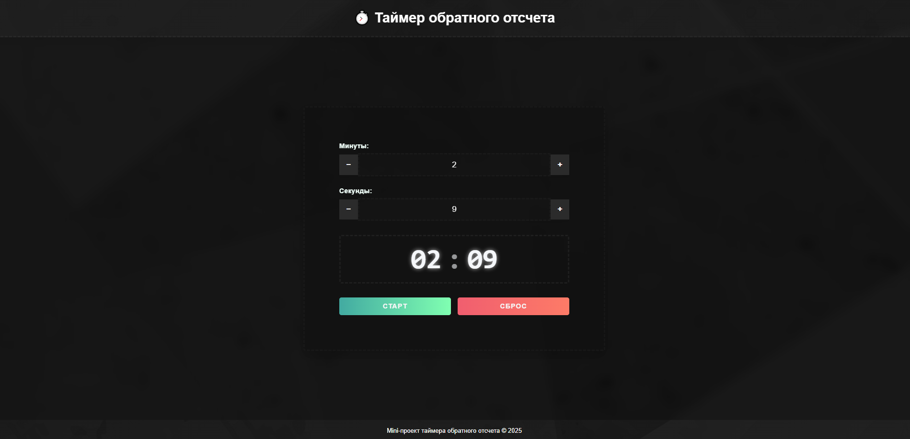
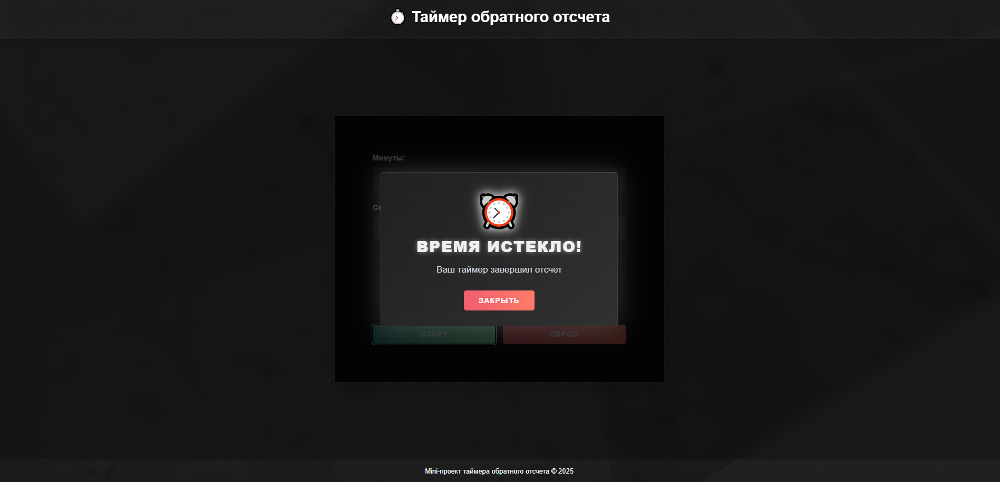

# ⏱️ Таймер обратного отсчета на React



## 🌟 Особенности

-   🕒 Точный отсчет времени
-   💾 Автосохранение состояния в localStorage
-   🎨 Плавные анимации и современный дизайн
-   ⚡ Быстрое управление: старт, пауза, сброс
-   🎛️ Удобный ввод времени с кнопками +/-

## 🚀 Установка и запуск

1. Клонируйте репозиторий:

```bash
git clone https://github.com/Hamptooon/timer-reverse.git
```

2. Установите зависимости:

```bash
npm install
```

3. Запустите приложение:

```bash
cd ./frontend
npm run start
```

## 🖥️ Скриншоты

| Таймер                                     | Оповещение                              |
| ------------------------------------------ | --------------------------------------- |
|  |  |

## 🧩 Структура проекта

Основные компоненты:

-   `TimerContainer` - ядро логики таймера
-   `TimerForm` - форма ввода времени
-   `TimerDisplay` - цифровое отображение времени
-   `TimerControls` - кнопки управления
-   `TimerAlert` - анимированное оповещение

## 🛠️ Технологии

-   React 19
-   TypeScript
-   SCSS модули
-   localStorage
-   Современные CSS-анимации
